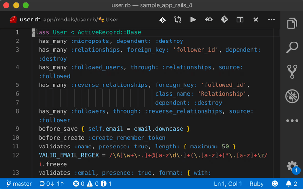

# Test Switcher

[](https://marketplace.visualstudio.com/items?itemName=bmalehorn.test-switcher)
[](https://marketplace.visualstudio.com/items?itemName=bmalehorn.test-switcher)

Switch between a file and its unit test:



On MacOS, press `Shift+Cmd+Y`.

On Windows / Linux, press `Shift+Ctrl+Y`.

The following formats are supported:

| framework               | application file       | unit test file          |
| ----------------------- | ---------------------- | ----------------------- |
| JavaScript / TypeScript | `*.js` †               | `__tests__/*.test.js`   |
| JavaScript / TypeScript | `*.js` †               | `test/*.test.js`        |
| JavaScript / TypeScript | `*.js` †               | `test/suite/*.test.js`  |
| JavaScript / TypeScript | `*.js` †               | `*.test.js`             |
| Python                  | `*.py`                 | `test/test_*.py`        |
| Go                      | `*.go`                 | `*_test.go`             |
| Ruby on Rails           | `app/*/*.rb`           | `spec/*/*_spec.rb`      |
| Ruby minitest           | `app/*.rb`             | `test/unit/*_test.rb`   |
| Ruby minitest           | `app/controllers/*.rb` | `test/integration/*.rb` |

† Also supports `.jsx`, `.ts`, `.tsx`.

## Extension Settings

You can add your own formats by editing `test-switcher.rules`.

Here's what it would look like to add Ruby on Rails support:

```json
"test-switcher.rules": [
  { "pattern": "app/(.*)\\.rb", "replacement": "spec/$1_spec.rb" },
  { "pattern": "spec/(.*)_spec\\.rb", "replacement": "app/$1.rb" },
]
```

Effectively, this extension runs `path.replace(new RegExp(pattern), replacement)`. If the source file matches the regex the replaced filename exists, you'll switch to that file. Otherwise, it will try the next rule.

## Release Notes

### 2.3.0

- JavaScript / TypeScript: Added support for `*.test.js` in the same directory

### 2.2.0

- Ruby: Added lib/ support

### 2.1.1

- added demo to README.md

### 2.1.0

- Ruby: Added support for minitest

### 2.0.0

- Go: fix a bug breaking directories containing `.`

### 1.4.0

- Python: added language, using `unittest` convention
- all languages: updated rules to work on all extensions, e.g. `file.x` <=> `file_test.x`

### 1.3.0

- JavaScript: support `.js` test on `.ts` file

### 1.2.0

- Rails: allow arbitrary depth directories, like `app/a/b/c.rb`
- JavaScript: add `test/suite/*.test.js` support

### 1.1.1

Update README.

### 1.1.0

Add support for `__tests__/*.test.js` directory.

### 1.0.0

Initial release.

## Similar Projects

- [Rails Go to Spec](https://marketplace.visualstudio.com/items?itemName=sporto.rails-go-to-spec)
- [File Switcher](https://marketplace.visualstudio.com/items?itemName=johnathanludwig.fileswitcher)
